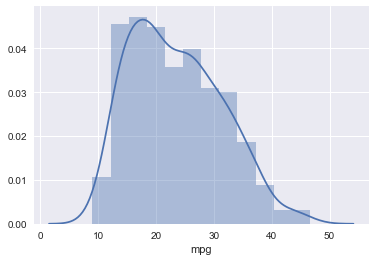
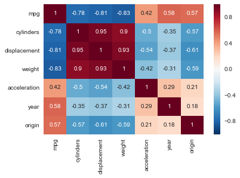
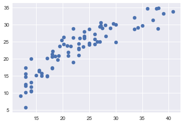
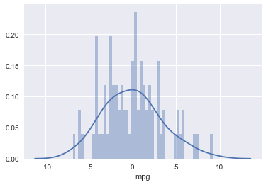

```python
import pandas as pd
```


```python
df = pd.read_csv("Auto.csv")
```


```python
df.head()
```


<div>
<table border="1" class="dataframe">
  <thead>
    <tr style="text-align: right;">
      <th></th>
      <th>mpg</th>
      <th>cylinders</th>
      <th>displacement</th>
      <th>horsepower</th>
      <th>weight</th>
      <th>acceleration</th>
      <th>year</th>
      <th>origin</th>
      <th>name</th>
    </tr>
  </thead>
  <tbody>
    <tr>
      <th>0</th>
      <td>18.0</td>
      <td>8</td>
      <td>307.0</td>
      <td>130</td>
      <td>3504</td>
      <td>12.0</td>
      <td>70</td>
      <td>1</td>
      <td>chevrolet chevelle malibu</td>
    </tr>
    <tr>
      <th>1</th>
      <td>15.0</td>
      <td>8</td>
      <td>350.0</td>
      <td>165</td>
      <td>3693</td>
      <td>11.5</td>
      <td>70</td>
      <td>1</td>
      <td>buick skylark 320</td>
    </tr>
    <tr>
      <th>2</th>
      <td>18.0</td>
      <td>8</td>
      <td>318.0</td>
      <td>150</td>
      <td>3436</td>
      <td>11.0</td>
      <td>70</td>
      <td>1</td>
      <td>plymouth satellite</td>
    </tr>
    <tr>
      <th>3</th>
      <td>16.0</td>
      <td>8</td>
      <td>304.0</td>
      <td>150</td>
      <td>3433</td>
      <td>12.0</td>
      <td>70</td>
      <td>1</td>
      <td>amc rebel sst</td>
    </tr>
    <tr>
      <th>4</th>
      <td>17.0</td>
      <td>8</td>
      <td>302.0</td>
      <td>140</td>
      <td>3449</td>
      <td>10.5</td>
      <td>70</td>
      <td>1</td>
      <td>ford torino</td>
    </tr>
  </tbody>
</table>
</div>


What are the *features*?

* cylinders: number of cylinders in a car
* displacement: displacement of the car engine
* horsepower: horsepower of the car
* weight: weight of the car in pounds
* acceleration: acceleration of the car
* year: year of the car
* origin: car company represented as number

What is the *response*?
* mpg: The number of miles per gallon you can expect from the car


```python
df.shape
```


    (397, 9)


### Questions about the Auto data

* Is there a relationship between the features/characteristics of the car and the miles per gallon(mpg)
* How strong is that relationship?
* What features most contribute to mpg?
* What is the effect of each feature of the car on the mpg?
* Given the list of features, can we predict the mileage of the cars?

### Linear Regression in scikit-learn


```python
df.columns
```


    Index(['mpg', 'cylinders', 'displacement', 'horsepower', 'weight',
           'acceleration', 'year', 'origin', 'name'],
          dtype='object')


#### Cleaning the data set

Notice that the horsepower feature has '?' for some of the rows. We will need to provide some numerical values to these cells


```python
df.drop(df[df['horsepower']=='?'].index, inplace=True)
```

#### Splitting into features and response variable


```python
X = df[['cylinders', 'displacement', 'horsepower', 'weight', 'acceleration', 'year', 'origin']]
```


```python
y = df['mpg']
```


```python
import seaborn as sns
%matplotlib inline
sns.distplot(y)
```


    <matplotlib.axes._subplots.AxesSubplot at 0x11d7522e8>





```python
sns.heatmap(df.corr(), annot=True)
```


    <matplotlib.axes._subplots.AxesSubplot at 0x11d769a90>





#### Splitting the data set into training set and the test set


```python
from sklearn.model_selection import train_test_split
```


```python
X_train, X_test, y_train, y_test = train_test_split(X, y, test_size=0.2, random_state=101)
```

#### Creating and training the model


```python
from sklearn.linear_model import LinearRegression
lm = LinearRegression()
lm.fit(X_train, y_train)
```


    LinearRegression(copy_X=True, fit_intercept=True, n_jobs=1, normalize=False)


```python
lm.coef_
```


    array([-0.4361437 ,  0.02124512, -0.00595217, -0.0070771 ,  0.17349795,
            0.79005957,  1.26057866])


```python
lm.intercept_
```


    -21.315312086788918


```python
X_train.columns
```


    Index(['cylinders', 'displacement', 'horsepower', 'weight', 'acceleration',
           'year', 'origin'],
          dtype='object')


```python
pd.DataFrame(lm.coef_, X_train.columns, columns=["Coeff"])
```


<div>
<table border="1" class="dataframe">
  <thead>
    <tr style="text-align: right;">
      <th></th>
      <th>Coeff</th>
    </tr>
  </thead>
  <tbody>
    <tr>
      <th>cylinders</th>
      <td>-0.436144</td>
    </tr>
    <tr>
      <th>displacement</th>
      <td>0.021245</td>
    </tr>
    <tr>
      <th>horsepower</th>
      <td>-0.005952</td>
    </tr>
    <tr>
      <th>weight</th>
      <td>-0.007077</td>
    </tr>
    <tr>
      <th>acceleration</th>
      <td>0.173498</td>
    </tr>
    <tr>
      <th>year</th>
      <td>0.790060</td>
    </tr>
    <tr>
      <th>origin</th>
      <td>1.260579</td>
    </tr>
  </tbody>
</table>
</div>


```python
predictions = lm.predict(X_test)
```


```python
import matplotlib.pyplot as plt
```


```python
plt.scatter(y_test, predictions)
```


    <matplotlib.collections.PathCollection at 0x11df5a2e8>





```python
%matplotlib inline
```


```python
plt.scatter(y_test, predictions)
```


    <matplotlib.collections.PathCollection at 0x11df912e8>


```python
lm.score(X_test, y_test) # calculate the R-squared
```


    0.80148042574254419


```python
df_new = X_test
```


```python
df_new['Actual Response'] = y_test
```

    /Users/apadmanabhan/anaconda2/envs/py3k/lib/python3.5/site-packages/ipykernel/__main__.py:1: SettingWithCopyWarning: 
    A value is trying to be set on a copy of a slice from a DataFrame.
    Try using .loc[row_indexer,col_indexer] = value instead
    
    See the caveats in the documentation: http://pandas.pydata.org/pandas-docs/stable/indexing.html#indexing-view-versus-copy
      if __name__ == '__main__':


```python
df_new['Predicted Response'] = predictions
```

    /Users/apadmanabhan/anaconda2/envs/py3k/lib/python3.5/site-packages/ipykernel/__main__.py:1: SettingWithCopyWarning: 
    A value is trying to be set on a copy of a slice from a DataFrame.
    Try using .loc[row_indexer,col_indexer] = value instead
    
    See the caveats in the documentation: http://pandas.pydata.org/pandas-docs/stable/indexing.html#indexing-view-versus-copy
      if __name__ == '__main__':


```python
df_new
```


<div>
<table border="1" class="dataframe">
  <thead>
    <tr style="text-align: right;">
      <th></th>
      <th>cylinders</th>
      <th>displacement</th>
      <th>horsepower</th>
      <th>weight</th>
      <th>acceleration</th>
      <th>year</th>
      <th>origin</th>
      <th>Actual Response</th>
      <th>Predicted Response</th>
    </tr>
  </thead>
  <tbody>
    <tr>
      <th>39</th>
      <td>8</td>
      <td>400.0</td>
      <td>175</td>
      <td>4464</td>
      <td>11.5</td>
      <td>71</td>
      <td>1</td>
      <td>14.0</td>
      <td>10.409826</td>
    </tr>
    <tr>
      <th>285</th>
      <td>8</td>
      <td>305.0</td>
      <td>130</td>
      <td>3840</td>
      <td>15.4</td>
      <td>79</td>
      <td>1</td>
      <td>17.0</td>
      <td>20.072615</td>
    </tr>
    <tr>
      <th>164</th>
      <td>6</td>
      <td>231.0</td>
      <td>110</td>
      <td>3039</td>
      <td>15.0</td>
      <td>75</td>
      <td>1</td>
      <td>21.0</td>
      <td>21.930925</td>
    </tr>
    <tr>
      <th>220</th>
      <td>4</td>
      <td>85.0</td>
      <td>70</td>
      <td>1945</td>
      <td>16.8</td>
      <td>77</td>
      <td>3</td>
      <td>33.5</td>
      <td>32.095429</td>
    </tr>
    <tr>
      <th>163</th>
      <td>6</td>
      <td>225.0</td>
      <td>95</td>
      <td>3785</td>
      <td>19.0</td>
      <td>75</td>
      <td>1</td>
      <td>18.0</td>
      <td>17.307213</td>
    </tr>
    <tr>
      <th>200</th>
      <td>6</td>
      <td>250.0</td>
      <td>78</td>
      <td>3574</td>
      <td>21.0</td>
      <td>76</td>
      <td>1</td>
      <td>18.0</td>
      <td>20.569851</td>
    </tr>
    <tr>
      <th>54</th>
      <td>4</td>
      <td>72.0</td>
      <td>69</td>
      <td>1613</td>
      <td>18.0</td>
      <td>71</td>
      <td>3</td>
      <td>35.0</td>
      <td>29.642632</td>
    </tr>
    <tr>
      <th>227</th>
      <td>6</td>
      <td>225.0</td>
      <td>100</td>
      <td>3630</td>
      <td>17.7</td>
      <td>77</td>
      <td>1</td>
      <td>19.0</td>
      <td>19.728974</td>
    </tr>
    <tr>
      <th>257</th>
      <td>6</td>
      <td>232.0</td>
      <td>90</td>
      <td>3210</td>
      <td>17.2</td>
      <td>78</td>
      <td>1</td>
      <td>19.4</td>
      <td>23.612904</td>
    </tr>
    <tr>
      <th>57</th>
      <td>4</td>
      <td>113.0</td>
      <td>95</td>
      <td>2278</td>
      <td>15.5</td>
      <td>72</td>
      <td>3</td>
      <td>24.0</td>
      <td>26.008970</td>
    </tr>
    <tr>
      <th>268</th>
      <td>4</td>
      <td>119.0</td>
      <td>97</td>
      <td>2300</td>
      <td>14.7</td>
      <td>78</td>
      <td>3</td>
      <td>27.2</td>
      <td>30.570399</td>
    </tr>
    <tr>
      <th>183</th>
      <td>4</td>
      <td>116.0</td>
      <td>81</td>
      <td>2220</td>
      <td>16.9</td>
      <td>76</td>
      <td>2</td>
      <td>25.0</td>
      <td>28.709064</td>
    </tr>
    <tr>
      <th>338</th>
      <td>4</td>
      <td>135.0</td>
      <td>84</td>
      <td>2490</td>
      <td>15.7</td>
      <td>81</td>
      <td>1</td>
      <td>27.2</td>
      <td>29.665570</td>
    </tr>
    <tr>
      <th>301</th>
      <td>4</td>
      <td>105.0</td>
      <td>70</td>
      <td>2200</td>
      <td>13.2</td>
      <td>79</td>
      <td>1</td>
      <td>34.2</td>
      <td>29.150041</td>
    </tr>
    <tr>
      <th>388</th>
      <td>6</td>
      <td>232.0</td>
      <td>112</td>
      <td>2835</td>
      <td>14.7</td>
      <td>82</td>
      <td>1</td>
      <td>22.0</td>
      <td>28.862361</td>
    </tr>
    <tr>
      <th>259</th>
      <td>6</td>
      <td>200.0</td>
      <td>85</td>
      <td>3070</td>
      <td>16.7</td>
      <td>78</td>
      <td>1</td>
      <td>20.8</td>
      <td>23.866865</td>
    </tr>
    <tr>
      <th>140</th>
      <td>8</td>
      <td>304.0</td>
      <td>150</td>
      <td>4257</td>
      <td>15.5</td>
      <td>74</td>
      <td>1</td>
      <td>14.0</td>
      <td>13.048228</td>
    </tr>
    <tr>
      <th>130</th>
      <td>4</td>
      <td>122.0</td>
      <td>80</td>
      <td>2451</td>
      <td>16.5</td>
      <td>74</td>
      <td>1</td>
      <td>26.0</td>
      <td>24.297580</td>
    </tr>
    <tr>
      <th>105</th>
      <td>8</td>
      <td>360.0</td>
      <td>170</td>
      <td>4654</td>
      <td>13.0</td>
      <td>73</td>
      <td>1</td>
      <td>13.0</td>
      <td>10.085499</td>
    </tr>
    <tr>
      <th>214</th>
      <td>8</td>
      <td>302.0</td>
      <td>130</td>
      <td>3870</td>
      <td>15.0</td>
      <td>76</td>
      <td>1</td>
      <td>13.0</td>
      <td>17.356989</td>
    </tr>
    <tr>
      <th>373</th>
      <td>4</td>
      <td>140.0</td>
      <td>92</td>
      <td>2865</td>
      <td>16.4</td>
      <td>82</td>
      <td>1</td>
      <td>24.0</td>
      <td>27.981774</td>
    </tr>
    <tr>
      <th>180</th>
      <td>4</td>
      <td>121.0</td>
      <td>115</td>
      <td>2671</td>
      <td>13.5</td>
      <td>75</td>
      <td>2</td>
      <td>25.0</td>
      <td>24.041192</td>
    </tr>
    <tr>
      <th>99</th>
      <td>6</td>
      <td>232.0</td>
      <td>100</td>
      <td>2945</td>
      <td>16.0</td>
      <td>73</td>
      <td>1</td>
      <td>18.0</td>
      <td>21.270318</td>
    </tr>
    <tr>
      <th>232</th>
      <td>8</td>
      <td>351.0</td>
      <td>149</td>
      <td>4335</td>
      <td>14.5</td>
      <td>77</td>
      <td>1</td>
      <td>16.0</td>
      <td>15.697368</td>
    </tr>
    <tr>
      <th>203</th>
      <td>4</td>
      <td>97.0</td>
      <td>71</td>
      <td>1825</td>
      <td>12.2</td>
      <td>76</td>
      <td>2</td>
      <td>29.5</td>
      <td>30.344942</td>
    </tr>
    <tr>
      <th>320</th>
      <td>4</td>
      <td>119.0</td>
      <td>92</td>
      <td>2434</td>
      <td>15.0</td>
      <td>80</td>
      <td>3</td>
      <td>37.0</td>
      <td>31.283997</td>
    </tr>
    <tr>
      <th>365</th>
      <td>6</td>
      <td>200.0</td>
      <td>88</td>
      <td>3060</td>
      <td>17.1</td>
      <td>81</td>
      <td>1</td>
      <td>20.2</td>
      <td>26.359358</td>
    </tr>
    <tr>
      <th>8</th>
      <td>8</td>
      <td>455.0</td>
      <td>225</td>
      <td>4425</td>
      <td>10.0</td>
      <td>70</td>
      <td>1</td>
      <td>14.0</td>
      <td>10.506399</td>
    </tr>
    <tr>
      <th>281</th>
      <td>6</td>
      <td>200.0</td>
      <td>85</td>
      <td>2990</td>
      <td>18.2</td>
      <td>79</td>
      <td>1</td>
      <td>19.8</td>
      <td>25.483340</td>
    </tr>
    <tr>
      <th>159</th>
      <td>8</td>
      <td>351.0</td>
      <td>148</td>
      <td>4657</td>
      <td>13.5</td>
      <td>75</td>
      <td>1</td>
      <td>14.0</td>
      <td>11.670878</td>
    </tr>
    <tr>
      <th>...</th>
      <td>...</td>
      <td>...</td>
      <td>...</td>
      <td>...</td>
      <td>...</td>
      <td>...</td>
      <td>...</td>
      <td>...</td>
      <td>...</td>
    </tr>
    <tr>
      <th>260</th>
      <td>6</td>
      <td>225.0</td>
      <td>110</td>
      <td>3620</td>
      <td>18.7</td>
      <td>78</td>
      <td>1</td>
      <td>18.6</td>
      <td>20.703781</td>
    </tr>
    <tr>
      <th>271</th>
      <td>4</td>
      <td>156.0</td>
      <td>105</td>
      <td>2745</td>
      <td>16.7</td>
      <td>78</td>
      <td>1</td>
      <td>23.2</td>
      <td>25.985381</td>
    </tr>
    <tr>
      <th>4</th>
      <td>8</td>
      <td>302.0</td>
      <td>140</td>
      <td>3449</td>
      <td>10.5</td>
      <td>70</td>
      <td>1</td>
      <td>17.0</td>
      <td>14.755827</td>
    </tr>
    <tr>
      <th>374</th>
      <td>4</td>
      <td>105.0</td>
      <td>74</td>
      <td>1980</td>
      <td>15.3</td>
      <td>82</td>
      <td>2</td>
      <td>36.0</td>
      <td>34.678297</td>
    </tr>
    <tr>
      <th>348</th>
      <td>4</td>
      <td>89.0</td>
      <td>62</td>
      <td>2050</td>
      <td>17.3</td>
      <td>81</td>
      <td>3</td>
      <td>37.7</td>
      <td>34.731919</td>
    </tr>
    <tr>
      <th>300</th>
      <td>8</td>
      <td>260.0</td>
      <td>90</td>
      <td>3420</td>
      <td>22.2</td>
      <td>79</td>
      <td>1</td>
      <td>23.9</td>
      <td>23.506838</td>
    </tr>
    <tr>
      <th>261</th>
      <td>6</td>
      <td>258.0</td>
      <td>120</td>
      <td>3410</td>
      <td>15.1</td>
      <td>78</td>
      <td>1</td>
      <td>18.1</td>
      <td>22.206946</td>
    </tr>
    <tr>
      <th>90</th>
      <td>8</td>
      <td>429.0</td>
      <td>198</td>
      <td>4952</td>
      <td>11.5</td>
      <td>73</td>
      <td>1</td>
      <td>12.0</td>
      <td>9.015530</td>
    </tr>
    <tr>
      <th>52</th>
      <td>4</td>
      <td>88.0</td>
      <td>76</td>
      <td>2065</td>
      <td>14.5</td>
      <td>71</td>
      <td>2</td>
      <td>30.0</td>
      <td>24.874219</td>
    </tr>
    <tr>
      <th>298</th>
      <td>8</td>
      <td>350.0</td>
      <td>125</td>
      <td>3900</td>
      <td>17.4</td>
      <td>79</td>
      <td>1</td>
      <td>23.0</td>
      <td>20.980776</td>
    </tr>
    <tr>
      <th>342</th>
      <td>4</td>
      <td>135.0</td>
      <td>84</td>
      <td>2385</td>
      <td>12.9</td>
      <td>81</td>
      <td>1</td>
      <td>30.0</td>
      <td>29.922871</td>
    </tr>
    <tr>
      <th>386</th>
      <td>6</td>
      <td>262.0</td>
      <td>85</td>
      <td>3015</td>
      <td>17.0</td>
      <td>82</td>
      <td>1</td>
      <td>38.0</td>
      <td>28.785591</td>
    </tr>
    <tr>
      <th>73</th>
      <td>8</td>
      <td>307.0</td>
      <td>130</td>
      <td>4098</td>
      <td>14.0</td>
      <td>72</td>
      <td>1</td>
      <td>13.0</td>
      <td>12.515900</td>
    </tr>
    <tr>
      <th>19</th>
      <td>4</td>
      <td>97.0</td>
      <td>46</td>
      <td>1835</td>
      <td>20.5</td>
      <td>70</td>
      <td>2</td>
      <td>26.0</td>
      <td>27.122650</td>
    </tr>
    <tr>
      <th>280</th>
      <td>6</td>
      <td>231.0</td>
      <td>115</td>
      <td>3245</td>
      <td>15.4</td>
      <td>79</td>
      <td>1</td>
      <td>21.5</td>
      <td>23.672919</td>
    </tr>
    <tr>
      <th>291</th>
      <td>8</td>
      <td>267.0</td>
      <td>125</td>
      <td>3605</td>
      <td>15.0</td>
      <td>79</td>
      <td>1</td>
      <td>19.2</td>
      <td>20.888780</td>
    </tr>
    <tr>
      <th>224</th>
      <td>8</td>
      <td>302.0</td>
      <td>130</td>
      <td>4295</td>
      <td>14.9</td>
      <td>77</td>
      <td>1</td>
      <td>15.0</td>
      <td>15.121932</td>
    </tr>
    <tr>
      <th>66</th>
      <td>8</td>
      <td>304.0</td>
      <td>150</td>
      <td>3672</td>
      <td>11.5</td>
      <td>72</td>
      <td>1</td>
      <td>17.0</td>
      <td>14.914220</td>
    </tr>
    <tr>
      <th>49</th>
      <td>4</td>
      <td>122.0</td>
      <td>86</td>
      <td>2220</td>
      <td>14.0</td>
      <td>71</td>
      <td>1</td>
      <td>23.0</td>
      <td>23.092753</td>
    </tr>
    <tr>
      <th>18</th>
      <td>4</td>
      <td>97.0</td>
      <td>88</td>
      <td>2130</td>
      <td>14.5</td>
      <td>70</td>
      <td>3</td>
      <td>27.0</td>
      <td>25.004506</td>
    </tr>
    <tr>
      <th>15</th>
      <td>6</td>
      <td>198.0</td>
      <td>95</td>
      <td>2833</td>
      <td>15.5</td>
      <td>70</td>
      <td>1</td>
      <td>22.0</td>
      <td>18.913452</td>
    </tr>
    <tr>
      <th>13</th>
      <td>8</td>
      <td>455.0</td>
      <td>225</td>
      <td>3086</td>
      <td>10.0</td>
      <td>70</td>
      <td>1</td>
      <td>14.0</td>
      <td>19.982634</td>
    </tr>
    <tr>
      <th>135</th>
      <td>6</td>
      <td>225.0</td>
      <td>105</td>
      <td>3613</td>
      <td>16.5</td>
      <td>74</td>
      <td>1</td>
      <td>18.0</td>
      <td>17.241148</td>
    </tr>
    <tr>
      <th>143</th>
      <td>4</td>
      <td>97.0</td>
      <td>78</td>
      <td>2300</td>
      <td>14.5</td>
      <td>74</td>
      <td>2</td>
      <td>26.0</td>
      <td>25.760581</td>
    </tr>
    <tr>
      <th>118</th>
      <td>4</td>
      <td>116.0</td>
      <td>75</td>
      <td>2158</td>
      <td>15.5</td>
      <td>73</td>
      <td>2</td>
      <td>24.0</td>
      <td>26.570481</td>
    </tr>
    <tr>
      <th>17</th>
      <td>6</td>
      <td>200.0</td>
      <td>85</td>
      <td>2587</td>
      <td>16.0</td>
      <td>70</td>
      <td>1</td>
      <td>21.0</td>
      <td>20.843179</td>
    </tr>
    <tr>
      <th>82</th>
      <td>4</td>
      <td>120.0</td>
      <td>97</td>
      <td>2506</td>
      <td>14.5</td>
      <td>72</td>
      <td>3</td>
      <td>23.0</td>
      <td>24.358705</td>
    </tr>
    <tr>
      <th>58</th>
      <td>4</td>
      <td>97.5</td>
      <td>80</td>
      <td>2126</td>
      <td>17.0</td>
      <td>72</td>
      <td>1</td>
      <td>25.0</td>
      <td>24.583761</td>
    </tr>
    <tr>
      <th>344</th>
      <td>4</td>
      <td>86.0</td>
      <td>64</td>
      <td>1875</td>
      <td>16.4</td>
      <td>81</td>
      <td>1</td>
      <td>39.0</td>
      <td>33.217466</td>
    </tr>
    <tr>
      <th>283</th>
      <td>6</td>
      <td>232.0</td>
      <td>90</td>
      <td>3265</td>
      <td>18.2</td>
      <td>79</td>
      <td>1</td>
      <td>20.2</td>
      <td>24.187221</td>
    </tr>
  </tbody>
</table>
<p>79 rows × 9 columns</p>
</div>


#### Calculate Regression Evaluation Metrics


```python
from sklearn import metrics
```


```python
metrics.mean_absolute_error(y_test, predictions) #Mean Absolute Error
```


    2.6201724292173711


```python
metrics.mean_squared_error(y_test, predictions) #Mean Squared Error
```


    10.819837191236575


```python
import numpy as np
np.sqrt(metrics.mean_squared_error(y_test, predictions)) #Root Mean Squared Error
```


    3.2893520929259874


```python
sns.distplot((y_test-predictions),bins=50)
```


    <matplotlib.axes._subplots.AxesSubplot at 0x11a8b8dd8>





```python

```
